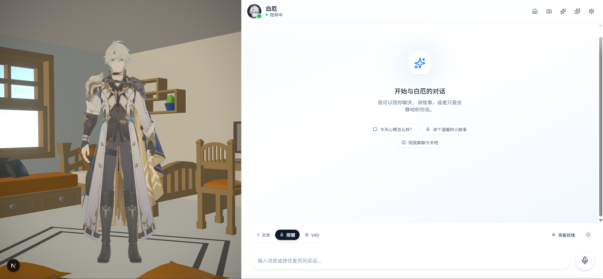
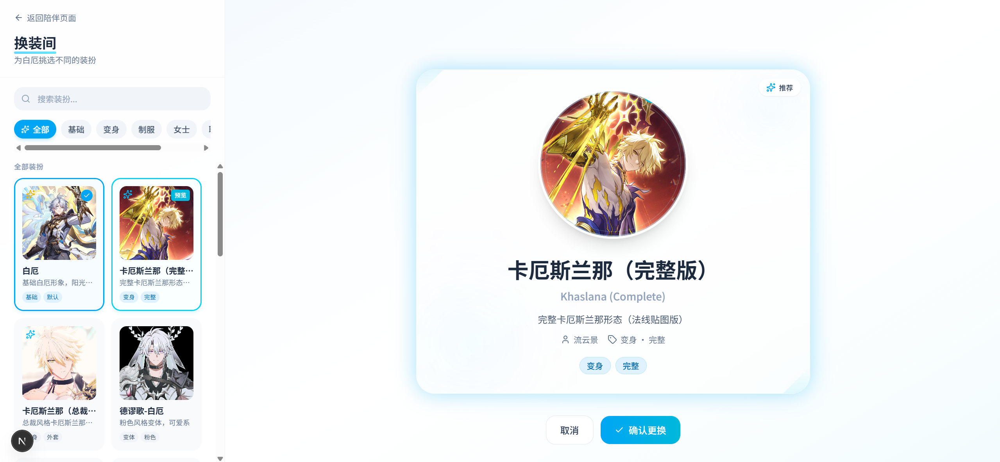

# 二次元情感陪伴助手

二次元情感陪伴助手（Web/PWA）：文字聊天、语音聊天、3D 角色互动、换装、回忆相册。

<!-- PROJECT SHIELDS -->

[![Contributors][contributors-shield]][contributors-url]
[![Forks][forks-shield]][forks-url]
[![Stargazers][stars-shield]][stars-url]
[![Issues][issues-shield]][issues-url]
[![License][license-shield]][license-url]

<!-- PROJECT LOGO -->
<br />

<p align="center">
  <h3 align="center">二次元情感陪伴助手</h3>
  <p align="center">
    基于《崩坏：星穹铁道》角色的同人情感陪伴应用
    <br />
    <a href="docs/README.md"><strong>探索项目文档 »</strong></a>
    <br />
    <br />
    <a href="https://github.com/Jonah-Wu23/anima-companion#功能特性">查看功能</a>
    ·
    <a href="https://github.com/Jonah-Wu23/anima-companion/issues">报告 Bug</a>
    ·
    <a href="https://github.com/Jonah-Wu23/anima-companion/issues">提出新特性</a>
  </p>
</p>

## 目录

- [上手指南](#上手指南)
  - [开发前的配置要求](#开发前的配置要求)
  - [安装步骤](#安装步骤)
- [文件目录说明](#文件目录说明)
- [页面与路由](#页面与路由)
- [功能特性](#功能特性)
- [使用的框架](#使用的框架)
- [贡献者](#贡献者)
  - [如何参与开源项目](#如何参与开源项目)
- [版本控制](#版本控制)
- [作者](#作者)
- [致谢](#致谢)
- [版权说明](#版权说明)

## 上手指南

### 开发前的配置要求

1. Python 3.11+
2. Node.js 18+
3. PowerShell 7+

### 安装步骤

1. Clone the repo

```sh
git clone https://github.com/Jonah-Wu23/anima-companion.git
```

2. 配置环境变量

```powershell
# 后端
Set-Location .\server
Copy-Item .env.example .env

# 前端
Set-Location ..\web
Copy-Item .env.example .env.local
```

3. 启动项目

```powershell
# 仅前后端（适合先验证文字+3D）
python .\scripts\dev\start_full_stack.py --frontend-backend-only --web-port 3000

# 全链路（含 SenseVoice + GPT-SoVITS）
python .\scripts\dev\start_full_stack.py --web-port 3000
```

## 文件目录说明

```text
filetree
├── LICENSE
├── README.md
├── web/                    Next.js 前端（主要交互）
├── server/                 FastAPI 后端（Auth/Chat/ASR/TTS/存储）
├── configs/                人设、动作清单、提示词、环境配置
├── assets/                 模型/贴图/参考音频/相册图片
├── data/                   本地数据（如相册索引）
├── docs/                   架构、计划、runbook、设计文档
└── scripts/                本地启动/校验脚本
```

## 页面与路由

- 首页：`/`
- 登录：`/login`
- 注册：`/register`
- 聊天主页面：`/chat`
- 换装页：`/wardrobe`
- 回忆相册：`/album`
- 打赏/启用 VIP：`/sponsor`

## 功能特性


### 聊天系统



- 文字聊天：基础对话功能
- 按键语音：按住/点按麦克风录音（VIP）
- VAD 语音：自动语音活动检测（VIP）

### 3D 角色互动
- 触摸反馈：单击、双击、长按、拖拽
- 命中区域：头部、面部、眼睛、手部、肩膀、身体
- 注视跟随：桌面端鼠标悬停响应

### 换装系统



- 多套白厄模型（基础、变身、制服、女士、联动等）
- 搜索、分类筛选、最近使用
- 预览确认机制

### 回忆相册


- 截图保存：3D 画布截图入库
- 隐私保护：可选开启，防止新截图入库
- Lightbox 查看、下载、删除

### 设置
- VIP 模式：开启语音输入和完整语音链路
- 自动播放语音：收到回复后自动朗读
- 减弱动画：降低动效和 3D 动态强度
- 清除数据：清空前端会话状态

## 使用的框架

- [Next.js](https://nextjs.org)
- [React](https://reactjs.org)
- [FastAPI](https://fastapi.tiangolo.com)
- [Three.js](https://threejs.org)
- [Tailwind CSS](https://tailwindcss.com)

## 贡献者

欢迎所有形式的贡献！

### 如何参与开源项目

贡献使开源社区成为一个学习、激励和创造的绝佳场所。任何贡献都非常感谢！

1. Fork the Project
2. Create your Feature Branch (`git checkout -b feature/AmazingFeature`)
3. Commit your Changes (`git commit -m 'Add some AmazingFeature'`)
4. Push to the Branch (`git push origin feature/AmazingFeature`)
5. Open a Pull Request

## 版本控制

该项目使用 Git 进行版本管理。您可以在 repository 参看当前可用版本。

## 作者

Jonah Wu (3582584159@qq.com)

*您也可以在贡献者名单中参看所有参与该项目的开发者。*

## 致谢

### 素材致谢

- **模型作者**：流云景、FixEll、苏酥鱼鱼喵、随着2时间的推移、林槿、填字小檀桌
- **动作提供方**：ot0510_standbypack、背景キャラ用ループ会話モーション、土下座のモーション、腕組みIA.モーション+、ミニモーション集

### 技术致谢

- [GPT-SoVITS](https://github.com/RVC-Boss/GPT-SoVITS)
- [Three.js](https://threejs.org)
- [PMX Editor](https://seiga.nicovideo.jp/)

## 版权说明

### 版权声明

本项目（二次元情感陪伴助手 / Phainon Companion）为《崩坏：星穹铁道》同人衍生作品，严格遵循 **[《崩坏：星穹铁道》同人衍生作品创作指引 V3.0](https://www.bilibili.com/opus/1089707102255972370)** 进行创作。

- **版权归属**：角色"白厄"、世界观、游戏原文文本、美术素材、音频素材等内容的知识产权均归 **上海米哈游海渊城科技有限公司** 及 **HoYoverse** 所有。
- **项目性质**：本项目为粉丝个人开发，**非米哈游官方应用**。
- **严禁商用**：本项目源代码及服务仅供学习交流，**严禁任何形式的商业盈利行为**。

### 免责声明

因用户个人违规使用（如生成不当内容、进行商业倒卖等）而产生的任何法律责任，由用户自行承担，与项目开发者及米哈游无关。若本项目侵犯了您的合法权益，请联系开发者进行删除或整改。

*This project is a fan-made work based on "Honkai: Star Rail". All rights regarding the character Phainon and game assets belong to miHoYo/HoYoverse.*

<!-- links -->
[contributors-shield]: https://img.shields.io/github/contributors/Jonah-Wu23/anima-companion.svg?style=flat-square
[contributors-url]: https://github.com/Jonah-Wu23/anima-companion/graphs/contributors
[forks-shield]: https://img.shields.io/github/forks/Jonah-Wu23/anima-companion.svg?style=flat-square
[forks-url]: https://github.com/Jonah-Wu23/anima-companion/network/members
[stars-shield]: https://img.shields.io/github/stars/Jonah-Wu23/anima-companion.svg?style=flat-square
[stars-url]: https://github.com/Jonah-Wu23/anima-companion/stargazers
[issues-shield]: https://img.shields.io/github/issues/Jonah-Wu23/anima-companion.svg?style=flat-square
[issues-url]: https://github.com/Jonah-Wu23/anima-companion/issues
[license-shield]: https://img.shields.io/github/license/Jonah-Wu23/anima-companion.svg?style=flat-square
[license-url]: https://github.com/Jonah-Wu23/anima-companion/blob/master/LICENSE

