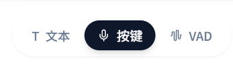
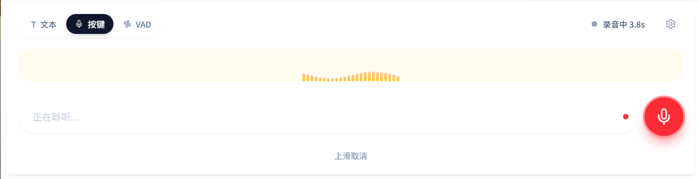
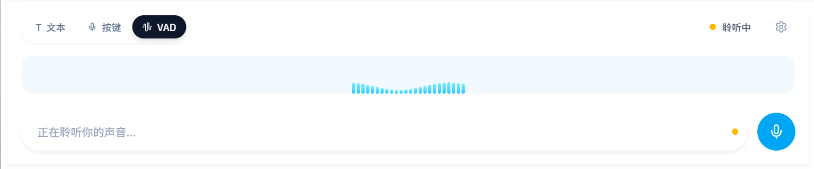
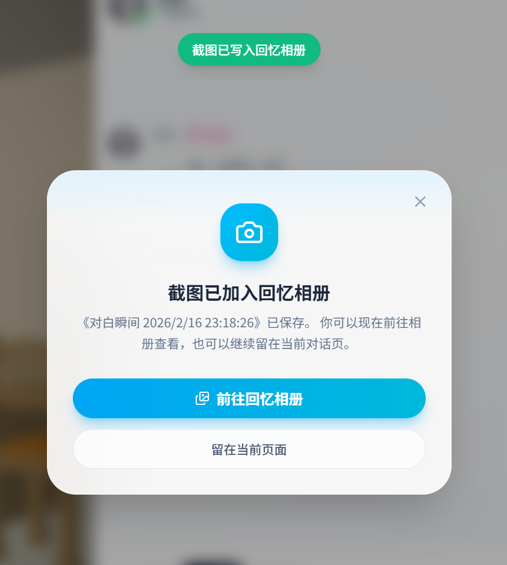
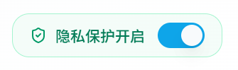
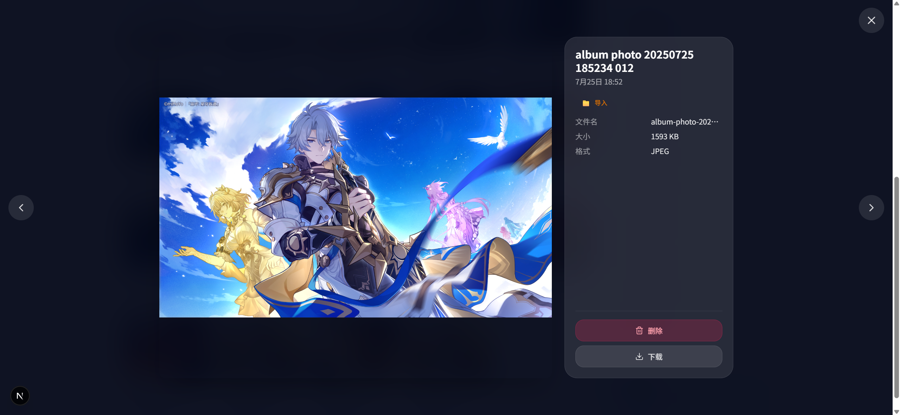
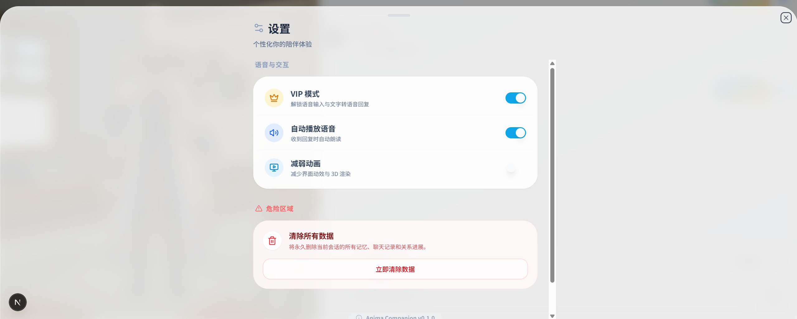
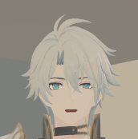

# 白厄 陪伴助手（Web/PWA）

一个以 Web 为主战场的二次元陪伴项目：文字聊天、语音聊天、3D 角色互动、换装、回忆相册。

## 1. 项目结构
```text
web/                Next.js 前端（主要交互都在这里）
server/             FastAPI 后端（Auth/Chat/ASR/TTS/存储）
configs/            人设、动作清单、提示词、环境配置
assets/             模型/贴图/参考音频/相册图片
data/               本地数据（如相册索引）
docs/               架构、计划、runbook、设计文档
scripts/            本地启动/校验脚本
```

## 2. 快速启动（PowerShell）
## 2.1 前置
- Python 3.11+
- Node.js 18+
- PowerShell 7+

## 2.2 环境变量
```powershell
# 后端
Set-Location .\server
Copy-Item .env.example .env

# 前端
Set-Location ..\web
Copy-Item .env.example .env.local

Set-Location ..
```

至少要配置后端 `.env` 里的 `LLM_API_KEY`，否则对话会失败。

## 2.3 一键启动（推荐）
```powershell
# 仅前后端（适合先验证文字+3D）
python .\scripts\dev\start_full_stack.py --frontend-backend-only --web-port 3000

# 全链路（含 SenseVoice + GPT-SoVITS，需本机存在默认路径）
python .\scripts\dev\start_full_stack.py --web-port 3000
```

说明：
- 一键脚本会把后端固定在 `18000`，并自动让前端走 `http://127.0.0.1:18000`。
- 如果你手动启后端到 `8000`，记得把 `web/.env.local` 的 `NEXT_PUBLIC_API_BASE_URL` 改成 `http://127.0.0.1:8000`。

## 3. 页面与路由
- 首页：`/`
- 登录：`/login`
- 注册：`/register`
- 聊天主页面：`/chat`
- 换装页：`/wardrobe`
- 回忆相册：`/album`
- 打赏/启用 VIP：`/sponsor`

## 4. Chat 页面详细教程
## 4.1 顶部按钮（从左到右）
1. `主页`（Home 图标）
   返回 `/` 首页。
2. `截图`（相机图标）
   把当前 3D 画布截图并尝试保存到相册。
3. `换装`（Sparkles 图标）
   进入 `/wardrobe` 换装间。
4. `相册`（Images 图标）
   进入 `/album` 回忆相册。
5. `设置`（齿轮图标）
   打开底部设置抽屉（VIP、自动播放、减弱动画、清理数据）。

## 4.2 聊天区
- 中间是消息面板，支持用户/角色气泡消息和“正在思考”状态。
- 首次进入无消息时，会显示 3 个快捷开场按钮，可直接触发一轮文字对话。

## 4.3 输入区的 3 种模式（你问的“语音输入三个切换”）
模式开关在输入栏上方，分别是：

1. `文本`
   - 含义：纯文字输入。
   - 用法：输入内容，点发送或回车。
   - 是否需要 VIP：不需要。

2. `按键`（push-to-talk）
   - 含义：按住/点按麦克风录音，松开后发送。
   - 用法：
     - 按住说话，松开结束并发送。
     - 也支持“轻点开始，再点结束”（有最短释放保护，防误触）。
     - 录音时上滑可取消（显示“松开手指取消发送”）。
   - 规则：
     - 录音太短（<500ms）会被丢弃。
   - 是否需要 VIP：需要；未启用会弹窗引导去 `/sponsor`。

3. `VAD`
   - 含义：自动语音活动检测，直接说话，不用按住。
   - 用法：
     - 切到 VAD 后直接说话，系统自动检测起止并提交。
   - 状态：
     - 待机中 / 倾听中 / 聆听中 / 处理中（状态条会实时变化）。
   - 是否需要 VIP：需要；未启用会引导去 `/sponsor`。

## 4.4 VIP 与语音能力关系
- 语音输入（按键/VAD）需要 VIP 开关打开。
- 文字对话永远可用。
- “自动播放语音”打开后，文本回复会尝试走 TTS；未启用 VIP 会弹引导窗。
- Sponsor 页文案是“打赏自愿”，点“我已打赏，启用VIP”即可返回并启用。

## 5. 从 Chat 到换装页（详细步骤）
1. 在 `/chat` 顶部点击 `✨` 换装按钮。
2. 进入 `/wardrobe` 后，左侧是模型列表，右侧是大预览。
3. 点击任意卡片后进入“预览态”（不是立即生效）。
4. 点击 `确认更换` 才会切换当前模型。
5. 点击 `取消` 放弃本次预览。
6. 顶部 `返回陪伴页面` 返回 `/chat`。

补充：
- 支持搜索、分类筛选、最近使用。
- 当前内置多套白厄模型（基础、变身、制服、女士、联动等标签）。

## 6. 从 Chat 到相册页 + 截图全流程
## 6.1 进入相册
有两条路：
1. Chat 顶部点击 `相册` 图标，直接进入 `/album`。
2. 先在 Chat 点 `截图`，保存成功后弹窗里点“前往回忆相册”。

## 6.2 截图按钮到底截什么
- 截的是 `main canvas`（3D 画布），不是整页 UI。
- 成功后会出现顶部提示“截图已写入回忆相册”。
- 同时会弹出“截图已加入回忆相册”的确认弹窗。

## 6.3 截图保存到哪里
- 图片文件：`assets/photos/`
- 相册索引与事件：`data/album/store.json`
- 相册读取 URL 由本地路由 `/api/local-files/assets/photos/...` 提供。

## 6.4 为什么有时截图失败
最常见原因是相册里开启了“隐私保护”：
- 相册页右上角开关显示“隐私保护开启”时，新截图不会入库。
- 这时在 Chat 点截图会收到失败提示（后端拒绝写入）。

## 6.5 相册页可做什么
- 筛选：全部 / 截图 / 导入
- 查看：点卡片打开 Lightbox
- Lightbox 支持：上一张/下一张、下载、删除
- 事件时间线：最近 10 条操作（截图、导入、删除、隐私切换）

## 7. 角色触摸互动（支持什么、怎么互动）
## 7.1 支持的交互
- 单击
- 双击
- 长按
- 拖拽（仅部分区域）
- 悬停（桌面鼠标）

## 7.2 命中区域与优先级
优先级从高到低：
`head(10) > face(9) > eyes(8) > left/right hand(7) > shoulders(6) > body(5)`

## 7.3 每个区域支持动作
- `head`：单击/双击/长按/拖拽/悬停
- `face`：单击/双击/长按/悬停
- `eyes`：悬停/单击
- `leftHand/rightHand`：单击/双击/悬停（不支持拖拽）
- `shoulders`：单击/双击/拖拽/悬停
- `body`：单击/双击/拖拽/悬停

## 7.4 手势判定阈值（关键）
- 双击窗口：500ms 内、同一区域、位移足够近
- 长按阈值：500ms
- 拖拽启动：移动超过 10px
- 区域冷却：约 200ms（防止连点爆触发）

## 7.5 实操建议
1. 想看“注视跟随”：桌面端把鼠标在头/脸附近慢慢移动。
2. 想看“惊讶反馈”：同一区域快速双击。
3. 想看“抚摸感”：在头部长按后轻拖。
4. 想看“身体响应”：从身体或肩部开始拖拽。
5. 手部目前只建议点按，不要期待拖拽动作。

## 8. 设置页说明
- `VIP 模式`：开启后可用语音输入和完整语音链路。
- `自动播放语音`：收到回复后自动朗读（需 VIP 才能真正走语音）。
- `减弱动画`：降低动效和 3D 动态强度。
- `立即清除数据`：清空当前前端会话状态并重置会话。

## 9. 常用排查
1. 文字能聊，语音不能用
   - 先确认 VIP 是否开启。
   - 再确认麦克风权限、ASR/TTS 服务是否启动。
2. 前端请求后端失败
   - 检查 `NEXT_PUBLIC_API_BASE_URL` 是否和后端端口一致。
3. 截图按钮点了但相册没新增
   - 去 `/album` 看“隐私保护”是否开启。
4. 触摸反馈不明显
   - 先等模型加载完成。
   - 尽量命中头部/脸部区域，反馈更明显。

## 10. 功能截图
以下截图位于 `assets/readme_photos/`，可直接用于发布展示。

### 10.1 首页与 Chat
1. 首页首屏


2. Chat 全局布局（3D 区 + 消息区 + 输入区）


3. Chat 顶栏五个按钮


4. 文本/按键/VAD 三模式切换区


5. 按键录音中（波形 + 提示文案）


6. VAD 待机/倾听状态


7. 截图成功提示 + 相册弹窗（合并图）


### 10.2 换装与相册
8. 换装页全貌 + 确认更换/取消（合并图）


9. 相册页全貌（筛选 + 网格 + 事件时间线）


10. 隐私保护开关


11. Lightbox 大图查看


### 10.3 设置与互动
12. 设置抽屉（VIP、自动播放、减弱动画、清理数据）


13. 角色触摸互动示意


14. 打赏页 + 启用 VIP


## 11. License
This project is licensed under the Apache License, Version 2.0 (January 2004).
See `License` for the full text.
- http://www.apache.org/licenses/

## 12. 致谢与免责声明 (Acknowledgements & Disclaimer)

### 12.1 版权声明
本项目（白厄陪伴助手 / Phainon Companion）为《崩坏：星穹铁道》同人衍生作品，遵循 [《崩坏：星穹铁道》同人衍生作品创作指引 V1.0](https://www.miyoushe.com/sr/article/38389658) 进行创作。

- **版权归属**：本项目中涉及的角色“白厄”（Phainon）、相关世界观、游戏原文文本、美术素材（如贴图）、音频素材（如配音采样）等内容的知识产权均归 **上海米哈游海渊城科技有限公司** 及 **HoYoverse** 所有。
- **法定声明**：【《崩坏：星穹铁道》素材的权利归米哈游所有，其他内容的相关权利、利益均归各自所有者享有】。

### 12.2 项目性质
1. **非官方性质**：本项目由个人开发者（粉丝）出于对角色的喜爱而开发，**非米哈游官方应用**，也未获得米哈游的官方授权、赞助或认可。项目不代表官方立场。
2. **禁止商用**：本项目源代码及部署服务仅供学习、技术交流与同好分享使用。严禁将本项目或利用本项目生成的任何内容用于任何形式的商业盈利行为（包括但不限于打包出售、付费入群等）。

### 12.3 关于“打赏与VIP”
本项目中提及的“打赏/Sponsor”与“VIP功能”仅作为用户**自愿捐赠**以支持服务器运行成本（如 LLM API 调用费、GPU 服务器租赁费），并非出售游戏素材或数字商品。所有打赏所得将严格用于覆盖项目运营成本，不以盈利为目的。若官方政策发生变化，相关功能将随时调整或下线。

### 12.4 素材使用规范
- **AI 模型**：项目中使用的语音模型（GPT-SoVITS）与语言模型（LLM）均基于开源技术构建。语音合成仅用于角色扮演体验，严禁生成违反法律法规、社会公德或侵害他人权益的内容。
- **图像/模型**：项目中使用的 3D 模型及相关图片资源，若非官方提取物，均已获得原作者授权或遵循其开源协议；若为官方素材提取，仅用于非商业展示。

### 12.5 免责条款
用户在使用本项目时，请自觉遵守当地法律法规及《崩坏：星穹铁道》用户协议。因用户个人违规使用（如生成不当内容、进行商业倒卖等）而产生的任何法律责任，由用户自行承担，与项目开发者及米哈游无关。若本项目侵犯了您的合法权益，请联系开发者进行删除或整改。

### 12.6 素材致谢
- **模型作者致谢**：感谢以下模型作者/改模作者对同人生态的贡献（按当前工程登记）：`流云景`、`FixEll`、`苏酥鱼鱼喵`、`随着2时间的推移`、`林槿`、`填字小檀桌`。
- **动作提供方致谢**：感谢动作素材提供方与配布者（按当前动作登记包名）：`ot0510_standbypack`、`背景キャラ用ループ会話モーション`、`土下座のモーション`、`腕組みIA.モーション+`、`ミニモーション集`。
- 以上致谢信息以仓库内资产登记文档为准：`docs/assets/models/README.md`、`docs/assets/mmd-motion-registry.md`。

---

*This project is a fan-made work based on "Honkai: Star Rail". All rights regarding the character Phainon and game assets belong to miHoYo/HoYoverse.*
