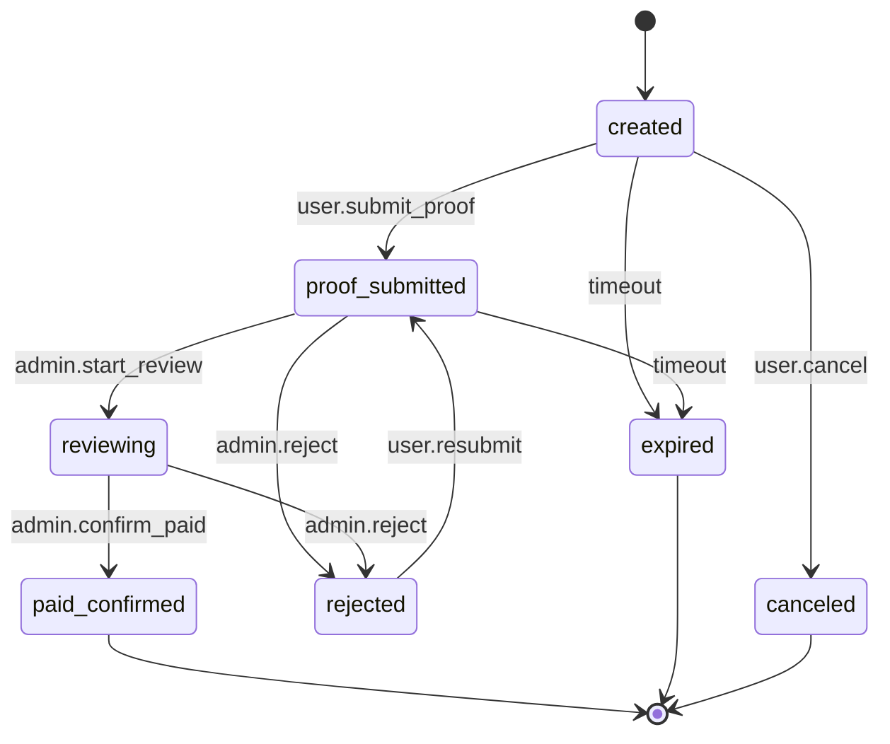
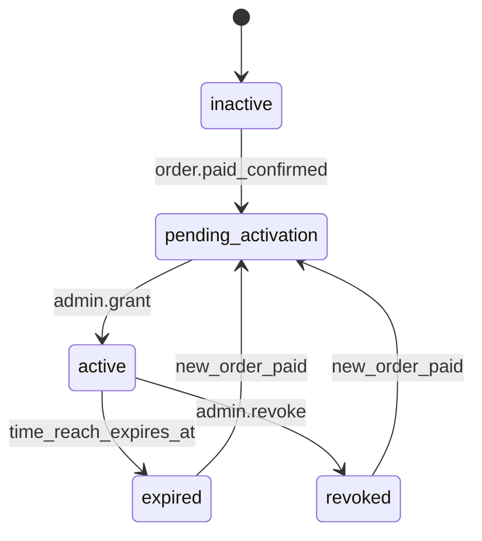

# Implementation Plan. Task List and Thought in Chinese

## P4 后端商业化闭环技术规范（FastAPI + MySQL）

日期：2026-02-16  
范围：账号 + 验证码 + 短信 + 订单 + 订阅 + VIP 鉴权 + 安全 Header/CSP  
目标：实现最小可上线闭环，且普通用户无法绕过支付链路直接开通 VIP

---

## 0. 冻结口径（本版生效）

1. 会话方案：同域 Cookie Session（主），不使用长期前端 JWT。
2. VIP 商品：`vip_monthly`，30 天，价格 `6.00 CNY`，服务端配置常量。
3. 支付流程：路线 A（二维码收款 + 人工核对 + 管理员开通）。
4. 权限边界：普通用户仅可“创建订单/提交凭证”；只有管理员可“确认支付/开通订阅”。
5. 前端错误文案：统一模糊，不暴露“账号是否存在”“手机号是否已注册”（除注册页显式提示已注册）。

---

## 1. 身份与会话架构

## 1.1 选型结论

- 认证凭据：`sid`（随机 256-bit），仅通过 `HttpOnly` Cookie 下发。
- 服务端存储：MySQL `auth_sessions` 存 `session_token_hash`（HMAC-SHA256 + server pepper），不落明文 token。
- Cookie 建议：
  - `sid`: `HttpOnly; Secure; SameSite=Lax; Path=/; Max-Age=7200`
  - `csrf_token`: `Secure; SameSite=Lax; Path=/`（非 HttpOnly，用于双提交）
- 会话轮转：登录成功后强制 rotate；登出将当前会话 `revoked_at`。

## 1.2 CSRF 策略（Cookie 场景）

- 机制：Double Submit Cookie + Origin 校验双保险。
- 规则：
  - 所有“已登录且有副作用”的接口必须校验 `X-CSRF-Token == csrf_token cookie`。
  - 同时校验 `Origin/Referer` 必须属于本站主域。
  - `GET/HEAD/OPTIONS` 不做 CSRF 校验。
- 例外：`/v1/auth/login/*`、`/v1/auth/register`、`/v1/auth/sms/send` 可不依赖登录态 CSRF，但仍需 captcha + 限流。

## 1.3 防爆破策略（认证层）

- 登录失败采用指数退避：第 3 次失败开始延迟，`2^(n-3)` 秒，最高 32 秒。
- 密码登录同时按 `IP + account` 双维度限流（详见第 4 节）。
- 所有失败统一返回 `AUTH_INVALID_CREDENTIALS`，避免账号枚举。

---

## 2. MySQL 数据模型（字段/索引/唯一性/审计）

## 2.1 表清单（最小闭环）

1. `users`：用户主表
2. `user_credentials`：密码凭据
3. `auth_sessions`：会话
4. `sms_challenges`：短信挑战与一次性消费
5. `orders`：订单
6. `payment_proofs`：支付凭证
7. `subscriptions`：订阅
8. `audit_logs`：审计日志（安全与支付关键动作）

## 2.2 字段与索引定义（摘要）

### `users`

- `id` BIGINT PK AUTO_INCREMENT
- `username` VARCHAR(32) NULL UNIQUE
- `phone` VARCHAR(20) NULL UNIQUE
- `phone_e164` VARCHAR(20) NULL UNIQUE
- `status` ENUM('active','locked','deleted') NOT NULL DEFAULT 'active'
- `created_at` DATETIME(3) NOT NULL
- `updated_at` DATETIME(3) NOT NULL
- `last_login_at` DATETIME(3) NULL
- 索引：`idx_users_status_created(status, created_at)`

### `user_credentials`

- `user_id` BIGINT PK FK -> users.id
- `password_hash` VARCHAR(255) NOT NULL
- `password_algo` VARCHAR(32) NOT NULL DEFAULT 'argon2id'
- `password_updated_at` DATETIME(3) NOT NULL
- `password_version` INT NOT NULL DEFAULT 1

### `auth_sessions`

- `id` BIGINT PK AUTO_INCREMENT
- `user_id` BIGINT NOT NULL FK
- `session_token_hash` CHAR(64) NOT NULL UNIQUE
- `csrf_token_hash` CHAR(64) NOT NULL
- `ip` VARBINARY(16) NULL
- `user_agent_hash` CHAR(64) NULL
- `created_at` DATETIME(3) NOT NULL
- `expires_at` DATETIME(3) NOT NULL
- `revoked_at` DATETIME(3) NULL
- 索引：
  - `idx_auth_sessions_user_expires(user_id, expires_at)`
  - `idx_auth_sessions_expires(expires_at)`

### `sms_challenges`

- `id` BIGINT PK AUTO_INCREMENT
- `challenge_id` CHAR(26) NOT NULL UNIQUE
- `phone` VARCHAR(20) NOT NULL
- `scene` ENUM('register','login','reset_password') NOT NULL
- `provider` VARCHAR(32) NOT NULL DEFAULT 'aliyun_dypns'
- `provider_biz_id` VARCHAR(64) NULL
- `status` ENUM('sent','verified','expired','failed') NOT NULL DEFAULT 'sent'
- `attempt_count` SMALLINT NOT NULL DEFAULT 0
- `max_attempts` SMALLINT NOT NULL DEFAULT 6
- `expires_at` DATETIME(3) NOT NULL
- `verified_at` DATETIME(3) NULL
- `used_at` DATETIME(3) NULL
- `created_at` DATETIME(3) NOT NULL
- 唯一与索引：
  - `uq_sms_challenge_id(challenge_id)`
  - `idx_sms_phone_scene_created(phone, scene, created_at)`
  - `idx_sms_expires(expires_at)`

### `orders`

- `id` BIGINT PK AUTO_INCREMENT
- `order_no` CHAR(26) NOT NULL UNIQUE
- `user_id` BIGINT NOT NULL FK
- `plan_code` VARCHAR(32) NOT NULL
- `amount_cny` DECIMAL(10,2) NOT NULL
- `pay_channel` ENUM('wechat','alipay') NOT NULL
- `status` ENUM('created','proof_submitted','reviewing','paid_confirmed','rejected','expired','canceled') NOT NULL
- `remark_token` VARCHAR(64) NOT NULL
- `proof_submit_count` SMALLINT NOT NULL DEFAULT 0
- `created_at` DATETIME(3) NOT NULL
- `updated_at` DATETIME(3) NOT NULL
- `expired_at` DATETIME(3) NOT NULL
- 索引：
  - `idx_orders_user_created(user_id, created_at DESC)`
  - `idx_orders_status_updated(status, updated_at DESC)`

### `payment_proofs`

- `id` BIGINT PK AUTO_INCREMENT
- `order_id` BIGINT NOT NULL FK
- `proof_type` ENUM('txn_id','payer_suffix','text_note','screenshot_ref') NOT NULL
- `proof_value` VARCHAR(255) NOT NULL
- `created_by_user_id` BIGINT NOT NULL FK
- `created_at` DATETIME(3) NOT NULL
- 索引：`idx_payment_proofs_order(order_id, created_at DESC)`

### `subscriptions`

- `id` BIGINT PK AUTO_INCREMENT
- `user_id` BIGINT NOT NULL FK
- `plan_code` VARCHAR(32) NOT NULL
- `status` ENUM('pending_activation','active','expired','revoked') NOT NULL
- `active_flag` TINYINT NULL DEFAULT NULL
- `source_order_id` BIGINT NULL FK -> orders.id
- `starts_at` DATETIME(3) NOT NULL
- `expires_at` DATETIME(3) NOT NULL
- `granted_by_admin_id` BIGINT NULL
- `created_at` DATETIME(3) NOT NULL
- `updated_at` DATETIME(3) NOT NULL
- 唯一与索引：
  - `uq_subscriptions_user_active(user_id, active_flag)`（仅 `active_flag=1`，其他状态 NULL）
  - `idx_subscriptions_user_expires(user_id, expires_at DESC)`
  - `idx_subscriptions_status_expires(status, expires_at)`

### `audit_logs`

- `id` BIGINT PK AUTO_INCREMENT
- `request_id` CHAR(26) NOT NULL
- `actor_type` ENUM('user','admin','system') NOT NULL
- `actor_id` BIGINT NULL
- `action` VARCHAR(64) NOT NULL
- `target_type` VARCHAR(32) NOT NULL
- `target_id` VARCHAR(64) NOT NULL
- `result` ENUM('success','deny','fail') NOT NULL
- `ip` VARBINARY(16) NULL
- `user_agent_hash` CHAR(64) NULL
- `detail_json` JSON NULL
- `created_at` DATETIME(3) NOT NULL
- 索引：
  - `idx_audit_actor_time(actor_type, actor_id, created_at DESC)`
  - `idx_audit_target(target_type, target_id, created_at DESC)`
  - `idx_audit_action_time(action, created_at DESC)`

## 2.3 最小审计日志事件（必须记录）

- 认证：`AUTH_REGISTER`、`AUTH_LOGIN_SUCCESS`、`AUTH_LOGIN_FAIL`、`AUTH_LOGOUT`
- 验证：`CAPTCHA_VERIFY_PASS/FAIL`、`SMS_SEND`、`SMS_VERIFY_PASS/FAIL`
- 订单：`ORDER_CREATE`、`ORDER_PROOF_SUBMIT`、`ORDER_REVIEW_START`、`ORDER_PAID_CONFIRM`、`ORDER_REJECT`
- 订阅：`SUB_PENDING`、`SUB_GRANT`、`SUB_EXPIRE`、`SUB_REVOKE`
- 权限：`VIP_ACCESS_ALLOW`、`VIP_ACCESS_DENY`

## 2.4 迁移策略

1. 引入 Alembic（仅新增，不迁移历史会话/聊天 SQLite）。
2. `20260216_01_init_auth_billing`：创建上述 8 表与索引。
3. `20260216_02_constraints_hardening`：补充唯一约束、状态枚举检查、默认值。
4. 部署顺序：先建表 -> 发布后端读写 -> 开启 VIP 强校验 -> 最后启用严格 CSP。

---

## 3. 接口列表与 Schema（含错误码语义）

## 3.1 统一响应壳

```json
{
  "code": "OK",
  "message": "ok",
  "request_id": "01J....",
  "data": {}
}
```

错误响应：

```json
{
  "code": "AUTH_INVALID_CREDENTIALS",
  "message": "账号或密码错误，请重试",
  "request_id": "01J....",
  "data": null
}
```

## 3.2 Auth + Captcha + SMS

### `POST /v1/auth/sms/send`

- 请求：
  - `phone` string
  - `scene` enum(`register`,`login`,`reset_password`)
  - `captcha_verify_param` string
- 响应 `data`：
  - `sms_challenge_id` string
  - `retry_after_sec` int

### `POST /v1/auth/register`

- 请求：
  - `phone` string
  - `sms_challenge_id` string
  - `sms_code` string
  - `password` string
  - `captcha_verify_param` string
- 响应 `data`：
  - `user_id` string
  - `need_profile_completion` bool

### `POST /v1/auth/login/password`

- 请求：
  - `account` string（用户名或手机号）
  - `password` string
  - `captcha_verify_param` string
- 响应 `data`：
  - `user_id` string
  - `expires_at` string (ISO8601)
  - `subscription` object

### `POST /v1/auth/login/sms`

- 请求：
  - `phone` string
  - `sms_challenge_id` string
  - `sms_code` string
  - `captcha_verify_param` string
- 响应同密码登录。

### `POST /v1/auth/logout`

- 请求：空（依赖 cookie）
- 响应：`data.ok = true`

### `GET /v1/auth/me`

- 响应 `data`：
  - `user_id`
  - `phone_masked`
  - `subscription`: `{ "is_vip": true, "plan_code": "vip_monthly", "expires_at": "..." }`

## 3.3 订单/订阅

### `POST /v1/orders/create`

- 请求：
  - `plan_code` 固定 `vip_monthly`
  - `pay_channel` enum(`wechat`,`alipay`)
- 响应 `data`：
  - `order_no`
  - `amount_cny`
  - `remark_token`
  - `expired_at`
  - `qrcode_asset_key`

### `POST /v1/orders/submit-proof`

- 请求：
  - `order_no` string
  - `proofs` array（每项：`proof_type`, `proof_value`）
  - `paid_at` string (ISO8601, optional)
- 响应 `data`：
  - `order_no`
  - `status`（`proof_submitted`）
  - `next_action`（`wait_manual_review`）

### `GET /v1/orders/{order_no}`

- 响应：订单详情与状态。

### `GET /v1/subscription/status`

- 响应：
  - `is_vip` bool
  - `status` enum(`inactive`,`pending_activation`,`active`,`expired`,`revoked`)
  - `expires_at` string|null

## 3.4 Admin（仅管理员）

### `POST /v1/admin/orders/{order_no}/review`

- 请求：
  - `decision` enum(`paid_confirmed`,`rejected`)
  - `reason` string(optional)
- 响应：订单最新状态

### `POST /v1/admin/subscriptions/grant`

- 请求：
  - `order_no`
  - `grant_days` int（默认 30）
- 响应：
  - `subscription_id`
  - `starts_at`
  - `expires_at`

## 3.5 错误码语义（前端弹窗依据）

| code | 语义 | 前端动作 |
|---|---|---|
| `AUTH_CAPTCHA_REQUIRED` | 人机验证失败/缺失 | 弹验证码失败提示，保留表单 |
| `AUTH_INVALID_CREDENTIALS` | 账号或密码错误（模糊） | 登录页错误 toast |
| `AUTH_SMS_INVALID` | 短信码错误或过期 | 清空短信码输入 |
| `AUTH_RATE_LIMITED` | 操作过频 | 显示剩余等待秒数 |
| `AUTH_FORBIDDEN` | 会话无效/权限不足 | 跳登录页 |
| `PAY_ORDER_NOT_FOUND` | 订单不存在/不属于当前用户 | 返回支付页首页 |
| `PAY_ORDER_EXPIRED` | 订单过期 | 引导重建订单 |
| `PAY_PROOF_INVALID` | 凭证格式非法 | 标红相关字段 |
| `PAY_REVIEW_PENDING` | 已提交待审核 | 显示等待状态 |
| `VIP_REQUIRED` | 需 VIP 才能访问 | 弹升级弹窗并跳 `/pay` |
| `ADMIN_REQUIRED` | 非管理员操作 | 提示无权限 |
| `SYS_INTERNAL_ERROR` | 系统异常 | 通用错误提示 |

---

## 4. 安全控制清单

## 4.1 密码哈希算法与参数

- 算法：`Argon2id`
- 参数建议：
  - `memory_cost = 65536`（64 MiB）
  - `time_cost = 3`
  - `parallelism = 2`
  - `hash_len = 32`
  - `salt_len = 16`
- 迁移策略：登录成功时若检测旧参数，后台透明 rehash。

## 4.2 限流策略（维度/阈值/退避）

### 认证相关

- `POST /v1/auth/login/password`
  - `IP`: 20 次 / 15 分钟
  - `account`: 5 次失败 / 15 分钟
- `POST /v1/auth/login/sms`
  - `IP`: 20 次 / 15 分钟
  - `phone`: 8 次 / 15 分钟
- 退避：连续失败 >=3 时指数退避，最多 32 秒。

### 短信相关

- `POST /v1/auth/sms/send`
  - `phone`: 1 次 / 60 秒，5 次 / 小时，10 次 / 天
  - `IP`: 20 次 / 小时
- `POST /v1/auth/* (sms verify)`
  - `challenge_id`: 最多 6 次验证

### 支付相关

- `POST /v1/orders/create`
  - `user_id`: 3 次 / 10 分钟
- `POST /v1/orders/submit-proof`
  - `order_no`: 5 次 / 天
  - `user_id`: 10 次 / 天

## 4.3 日志脱敏规则

- 手机号：仅保留前 3 后 2（例：`138*****12`）。
- `captcha_verify_param`：仅记录 `sha256[:12]`，不记录原文。
- 短信码：禁止入库、禁止入日志。
- 订单凭证：
  - 交易号仅保留后 6 位用于排障。
  - 截图不进应用日志，仅存受控对象存储引用。
- Token/Cookie：全部禁止日志打印。
- IP：业务日志可做 `/24` 脱敏；审计日志可保存原值但仅管理员可见。

## 4.4 权限边界

| 操作 | 普通用户 | 管理员 |
|---|---|---|
| 注册/登录/登出 | 允许 | 允许 |
| 发送短信/校验短信 | 允许 | 允许 |
| 创建订单 | 允许 | 允许 |
| 提交支付凭证 | 允许（仅本人订单） | 允许 |
| 确认支付 | 禁止 | 允许 |
| 开通/撤销订阅 | 禁止 | 允许 |
| 读取审计日志 | 禁止 | 允许（最小范围） |
| 调用 VIP 受限接口 | 仅有效 VIP | 可按业务策略放行 |

## 4.5 VIP 鉴权落点（FastAPI）

- 新增依赖：
  - `require_authenticated_user`
  - `require_vip_user`
  - `require_admin_user`
- 默认保护接口：
  - `POST /v1/chat/voice`
  - `POST /v1/chat/text-with-voice`
  - `POST /v1/tts/synthesize`
  - `GET /v1/asr/fun/realtime/ws`（握手阶段校验）

---

## 5. 订单与订阅状态机

## 5.1 订单状态机



## 5.2 订阅状态机



约束：

1. `admin.grant` 必须绑定已 `paid_confirmed` 订单。
2. 同一用户同一时刻仅允许一个 `active` 订阅（`uq_subscriptions_user_active` + 事务）。
3. 续费规则：`starts_at = max(now, 当前active.expires_at)`，避免时长丢失。

---

## 6. 关键威胁与防护点

| 威胁 | 攻击路径 | 防护点 |
|---|---|---|
| 二维码篡改 | XSS/静态资源替换导致收款码被换 | CSP 严格白名单；二维码静态资源哈希校验；发布目录只读；页面显式展示收款人名称二次核对 |
| 伪造支付 | 上传假截图/伪造流水号 | 订单号+备注 token 强绑定；仅 `paid_confirmed` 才可开通；人工核对收款后台；审计留痕 |
| 越权开通 | 普通用户直接调 admin 接口 | `require_admin_user`；后台网络隔离/固定来源；每次开通记录审计 |
| 账号爆破 | 密码撞库、短信穷举 | captcha 前置 + 多维限流 + 指数退避 + 模糊错误 |
| CSRF | 用户在已登录状态被诱导提交订单/凭证 | Double Submit + Origin 校验 + SameSite=Lax |
| 会话劫持 | token 泄露后长期可用 | HttpOnly Cookie；短会话；登录轮转；登出撤销；异常 IP/UA 审计 |

---

## 7. Captcha 2.0 与短信服务端封装规范

## 7.1 `CaptchaVerifier`（服务层）

接口：

```text
verify(captcha_verify_param, scene, client_ip, user_agent) -> CaptchaVerifyResult
```

返回：

- `passed: bool`
- `risk_level: str`
- `provider_request_id: str`

错误码映射：

- provider timeout -> `AUTH_CAPTCHA_REQUIRED`
- provider reject/risk -> `AUTH_CAPTCHA_REQUIRED`
- provider internal error -> `SYS_INTERNAL_ERROR`

## 7.2 `SmsAuthService`（服务层）

- `send_code(phone, scene, captcha_ok_context) -> sms_challenge_id`
- `verify_code(phone, sms_challenge_id, code, scene) -> verified`

重放防护：

1. `sms_challenge_id` 一次性，成功后写 `used_at`。
2. 过期或已使用挑战禁止再次验证。
3. `challenge_id + phone + scene` 必须一致，否则拒绝。

---

## 8. 安全 Header 与 CSP（生产）

推荐 Header：

- `Strict-Transport-Security: max-age=31536000; includeSubDomains`
- `X-Content-Type-Options: nosniff`
- `Referrer-Policy: strict-origin-when-cross-origin`
- `X-Frame-Options: DENY`（如 captcha 需要 iframe，仅在 captcha 页面局部放开 frame-ancestors）
- `Permissions-Policy: microphone=(self), camera=(), geolocation=()`
- `Content-Security-Policy`（示例）：

```text
default-src 'self';
script-src 'self' 'nonce-{nonce}' https://g.alicdn.com https://*.alicdn.com https://*.aliyuncs.com;
style-src 'self' 'nonce-{nonce}';
img-src 'self' data: blob:;
connect-src 'self' https://*.aliyuncs.com wss://dashscope.aliyuncs.com;
frame-src 'self' https://*.aliyun.com https://*.alicdn.com;
font-src 'self' data:;
base-uri 'self';
form-action 'self';
frame-ancestors 'none';
```

说明：

1. 先以 `Content-Security-Policy-Report-Only` 灰度 3-7 天，收敛后转强制。
2. 视觉实现必须避免内联脚本；如确需内联，统一 nonce 注入，不允许 `'unsafe-inline'`。

---

## 9. Task List（强逻辑AI执行拆解）

1. 数据层：创建 8 张表 + 索引 + Alembic 基线迁移。
2. 认证层：`register/login/logout/me` + cookie session + CSRF 校验。
3. 风控层：captcha 封装 + 短信封装 + 统一限流中间件。
4. 订单层：`create/submit-proof/query` + 状态机校验。
5. 管理层：`review/grant` + 审计日志。
6. 权限层：`require_vip_user` 接入 ASR/TTS/voice 端点。
7. 安全层：Header/CSP 上线流程（report-only -> enforce）。
8. 验证层：最小回归用例（认证、支付、越权、订阅到期）。

---

## 10. 验收标准（DoD）

1. 普通用户无法通过任意 API 直接变更 `subscriptions` 为 `active`。
2. 未开通或过期用户访问 VIP 接口必返回 `VIP_REQUIRED`。
3. 订单未 `paid_confirmed` 前无法执行 `admin grant`。
4. 所有关键动作有 `audit_logs` 记录，可按 `request_id` 追踪。
5. 认证与短信接口达到限流阈值后返回 `AUTH_RATE_LIMITED`。
6. 支付页二维码与收款人信息可双重核对，且前端 CSP 不允许外部恶意脚本注入。

